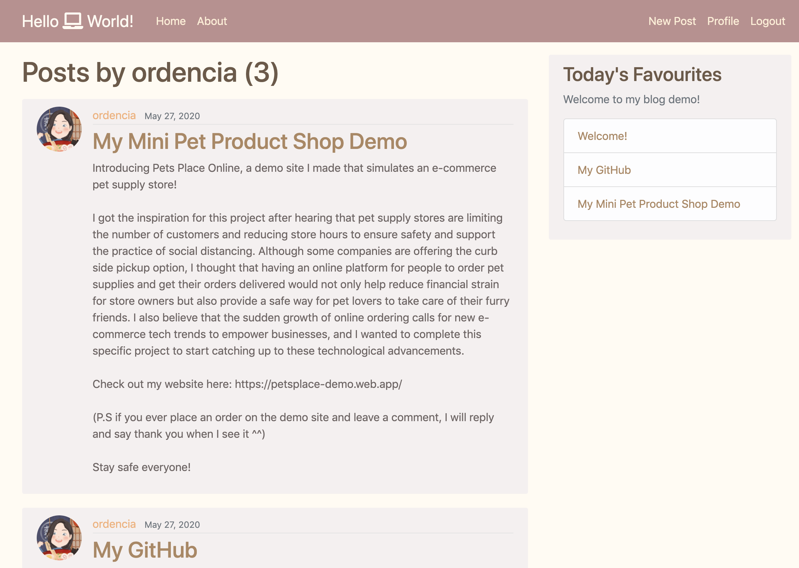
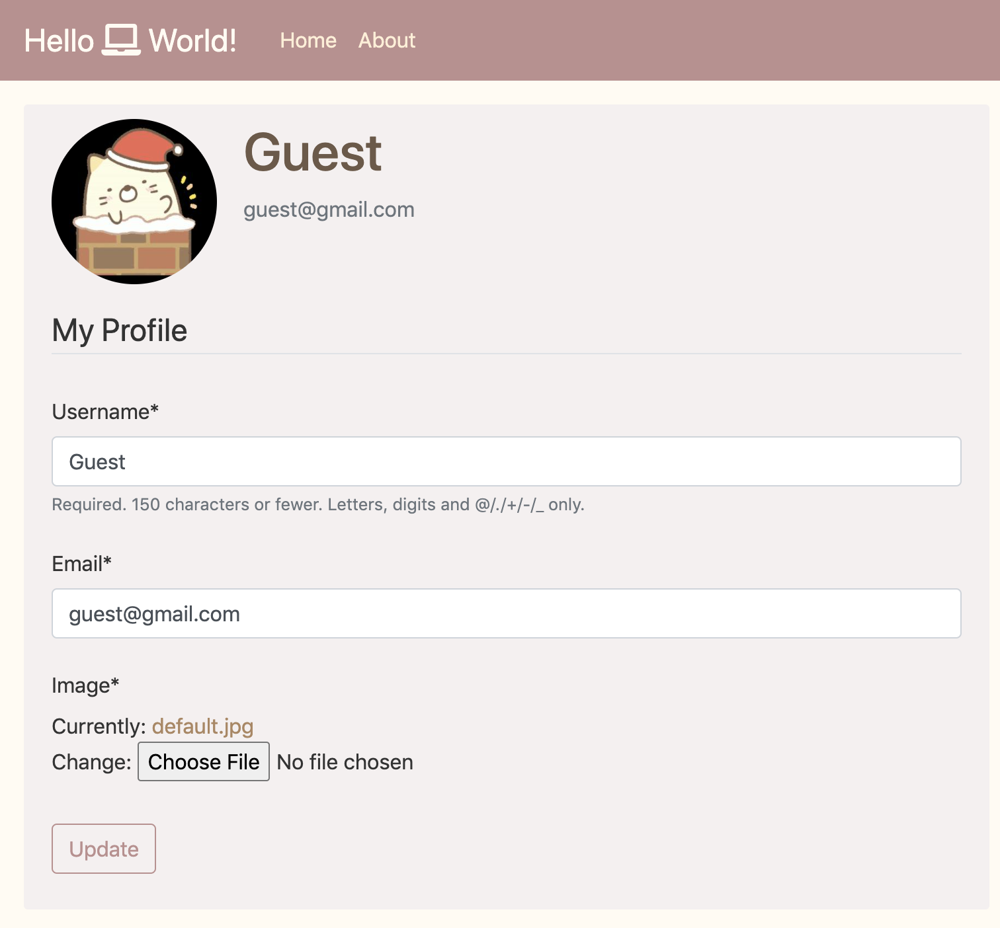

# hello-world-community
A programmer forum where everyone can post links to content they've made, ask for coding advice, and share their GitHub profiles
Please visit the forum [HERE](https://hello-world-community.herokuapp.com). You are welcome to create an account or log in with the guest credentials:

Username: Guest Password: guestuser123

## Technologies Used
Framework: Django, Language: Python, AWS

Deployed with Heroku

## What I learned
- Leveraged Django framework to build a full-featured web application that allows users to share their experience with software development and post side projects
- Supported user registration, profile update, publishing and editing blog posts
- Created database tables with Django DB models and used Django ORM to query the database and filter through posts
- Implemented pagination for post display pages using Django Paginator to reduce page rendering time as database grows
- Used AWS S3 to host user's profile images after deployment

## Sneak Peak
#### Author's Page

#### Personal Profile Page

Please visit the forum [HERE](https://hello-world-community.herokuapp.com) to see the intro (about) page and all posts :)

## Future extensions
I will extend the functionalities to support:
1. post topic categorization (for filtering)
2. upvote system (for sorting)
3. code snippet upload 
4. anonymous comment sections
